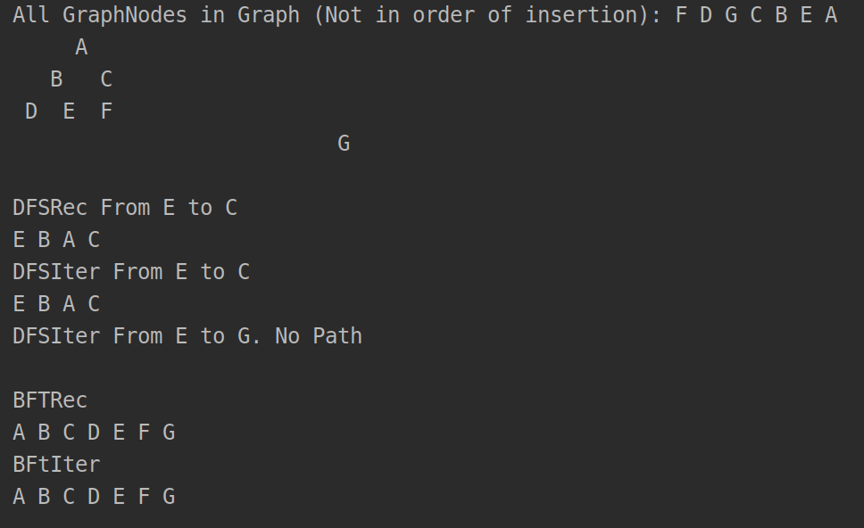
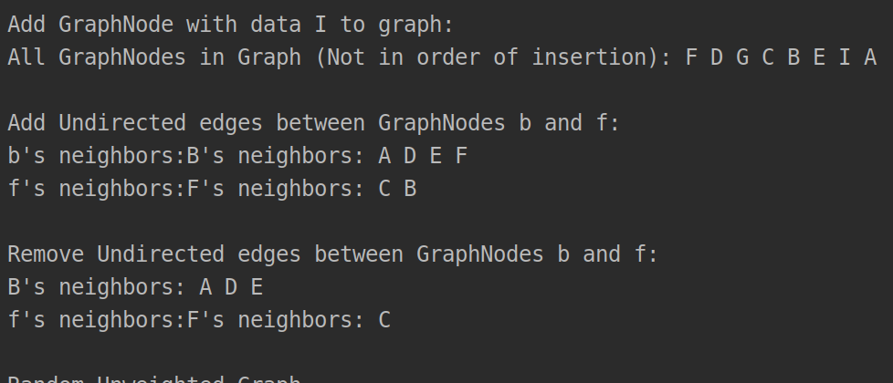
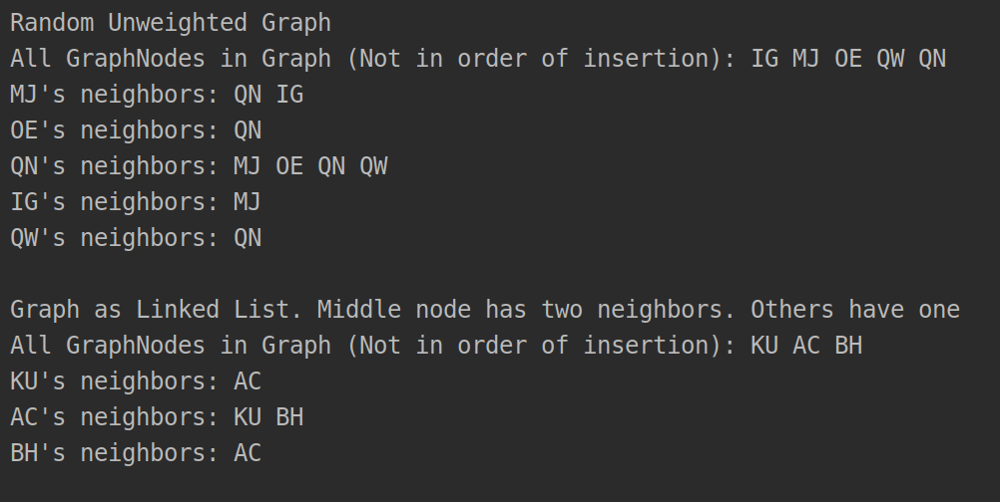
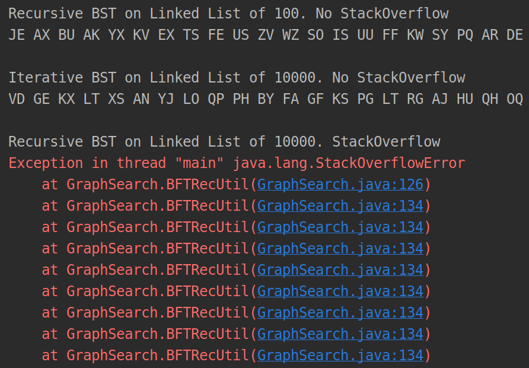

# Project2
# Parts 1 - 3
I haven't finished #5 and #6

DFS and BFT

Add Nodes, Add Edges and Remove Edges

Create Linked List and Random Graph

Run BFTRec on 100, BFTIter on 10000, and BFTRec on 10000

